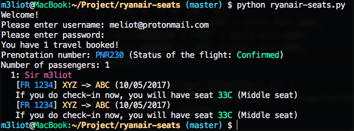
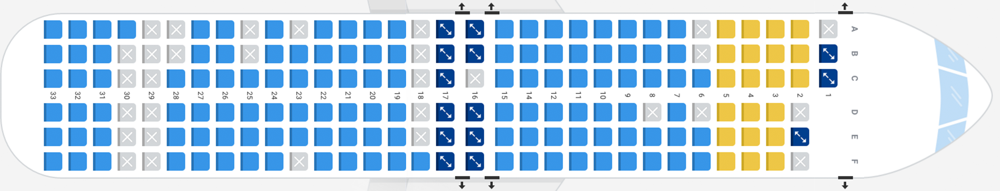

# Ryanair seats prediction
### A tool to predict which will be your free seat
##### And a trick to get that damn window-close seat! :P

This tool will try to predict which seat you will get for free if you will do the check-in just after running the tool (If nobody else will do check-in after you run the script but before you do the check-in).

### UPDATE 24/05/2017
I just realized that Ryanair seems to have changed the allocation algorithm. The tool is no more reliable then..
If somebody wants to update the algorithm, just send a pull requests or write to me :) We can work together on it.

### USAGE
It's not that hard :P

```
python ryanair-seats.py
```

And then log-in.

<p align="center">

</p>

### TO DO
- Currently the tool works only for one person, I need more investigation to understand how seats are allocated for more than one person.
- Even when predicting one seat, the tool can't be 100% reliable: there are "hard" situations that are currently not checked by the tool.


### FAQ

#### How it works?
Ryanair let customer buy a seat anytime for the flight they booked. Thanks to this, it's possible to get the list of the seats already reserved. With some analysis on the "Allocation Algorithm" it was possible to understand how the allocation works: Seats are allocated from the middle of the plane, to the ends (both top and down together). Seats are allocated (generally) from A to F.   If there is enough space to allocate all passengers of a booking, then the current row is filled. If passenger exceeded the current row space, then the system decide to put them in a new row.  
Emergency exit are "filled" when the other seats are allocated.

<p align="center">

</p>


#### What can I do with this tool?
This tool will try to predict which seat you will get for free if you will do the check-in just after running the tool :P (If nobody else will do check-in after you run the script but before you do the check-in).  
Or at least it will try, it's pretty accurate but not perfect yet :D

#### So, can I choose my seat?
Yes, you can! You just have to pay few euro and get your seat :)  
This tool doesn't want to provide a way to get free seats, but just to show how Ryanair seats are allocated.

---
